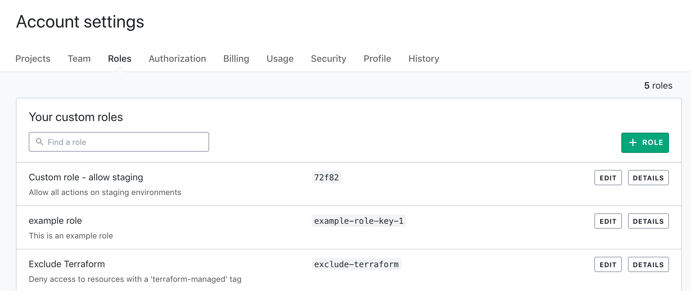
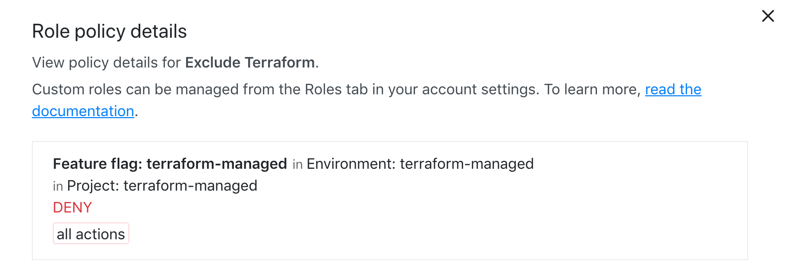

## Example: custom role

### Introduction
For enterprise customers, LaunchDarkly allows the configuration of custom roles to tailor user permissions. For more on these, see the [LaunchDarkly official documentation](https://docs.launchdarkly.com/home/account-security/custom-roles).

This directory provides an example a [custom role configuration](https://docs.launchdarkly.com/home/account-security/custom-roles/configure) that denies the user access to flags with the `"terraform-managed"` tag.  For more information on tags in custom roles, see the [LaunchDarkly documentation[(https://docs.launchdarkly.com/home/account-security/custom-roles/tags)]. 

To add the tag to any of your Terraform-managed resources, you will need to ensure 
```
tags = [
    "terraform-managed"
]
```
is added to all your resource configurations. Some examples can be found [here](../multiple_projects/example.tf).

### Run
Init your working directory from the CL with `terraform init` and then apply the changes with `terraform apply`. You should see output resembling the following:
```
launchdarkly_custom_role.excluding_terraform: Refreshing state... [id=excluding-terraform]

An execution plan has been generated and is shown below.
Resource actions are indicated with the following symbols:
  + create

Terraform will perform the following actions:

  # launchdarkly_custom_role.exclude_terraform will be created
  + resource "launchdarkly_custom_role" "exclude_terraform" {
      + description = "Deny access to resources with a 'terraform-managed' tag"
      + id          = (known after apply)
      + key         = "exclude-terraform"
      + name        = "Exclude Terraform"

      + policy {
          + actions   = [
              + "*",
            ]
          + effect    = "deny"
          + resources = [
              + "proj/*:env/:flag/*;terraform-managed",
            ]
        }
    }

Plan: 1 to add, 0 to change, 0 to destroy.
```
Terraform will then ask you for confirmation to apply the changes. If there are no issues, you should then see the following output:
```
launchdarkly_custom_role.exclude_terraform: Creating...
launchdarkly_custom_role.exclude_terraform: Creation complete after 1s [id=exclude-terraform]
```

You should then be able to confirm the creation of your custom role by navigating to the Account settings > Roles page within your LaunchDarkly dashboard, which should now have the "Exclude Terraform" role listed:



To view the policy details, click on the role to expand:

